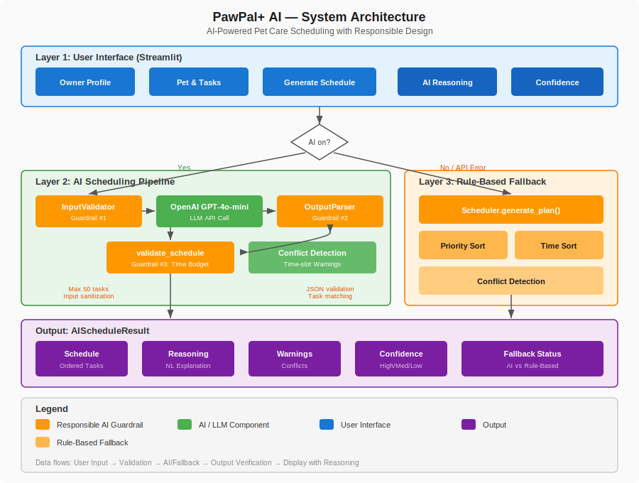

# PawPal+ AI — Applied AI Pet Care Scheduling System

PawPal+ AI is an intelligent pet care scheduling system that uses OpenAI's GPT to generate optimized daily plans with transparent, explainable reasoning. It evolves the original PawPal+ prototype from Modules 1-3 into a full applied AI system with responsible design principles.

## Original Project (Modules 1-3)

This project began as **PawPal+**, a rule-based pet care scheduling tool built across the first three course modules. The original system let pet owners enter their profiles, add pets with care tasks, and generate a daily plan sorted by priority and time constraints. It used pure Python classes (Owner, Pet, Task, Scheduler) with a Streamlit interface, handling conflict detection and recurrence logic without any AI involvement.

## Title and Summary

**PawPal+ AI** helps busy pet owners plan their daily pet care by combining rule-based scheduling logic with LLM-powered intelligence. Users enter their profile, pets, and care tasks through a Streamlit web interface, and the system sends that data to OpenAI's GPT-4o-mini to generate an optimized schedule alongside natural language reasoning that explains *why* tasks are ordered the way they are. If the AI is unavailable (no API key, network error, malformed response), the system automatically falls back to the original rule-based scheduler and tells the user.

This matters because pet care scheduling involves real welfare stakes — skipping medication or neglecting feeding has consequences. An AI scheduler that explains its reasoning and discloses when it's uncertain gives pet owners both convenience and the confidence to trust (or override) the plan.

## Architecture Overview



The system follows a three-layer design:

1. **User Interface (Streamlit)** — Collects owner, pet, and task data. Displays schedules with AI reasoning, confidence indicators, and an optional transparency panel.
2. **AI Scheduling Pipeline** — Validates inputs, calls OpenAI GPT-4o-mini, parses the JSON output, maps suggested tasks back to real Task objects, and enforces time constraints.
3. **Rule-Based Fallback** — The original Module 2 scheduler serves as a safety net when AI is unavailable, producing its own reasoning string.

Three responsible AI guardrails sit between each stage: `InputValidator` sanitizes data before the LLM sees it, `OutputParser` ensures the AI response is valid JSON mapping to real tasks, and `validate_schedule` enforces the owner's time budget regardless of what the AI suggests. Every `AIScheduleResult` includes a `used_fallback` flag so users always know whether AI or rules generated their plan.

## Setup Instructions

**Prerequisites:** Python 3.9+ and pip.

1. Clone the repository and navigate into the project folder:
   ```bash
   git clone https://github.com/vdynak/applied-ai-system-project.git
   cd applied-ai-system-project
   ```

2. Create and activate a virtual environment:
   ```bash
   python -m venv .venv
   source .venv/bin/activate  # Windows: .venv\Scripts\activate
   ```

3. Install dependencies:
   ```bash
   pip install -r requirements.txt
   ```

4. Set your OpenAI API key (optional — the app works without it via fallback):
   ```bash
   export OPENAI_API_KEY="sk-..."  # macOS/Linux
   set OPENAI_API_KEY=sk-...       # Windows
   ```
   You can also enter the key directly in the app's sidebar at runtime.

5. Run the Streamlit app:
   ```bash
   streamlit run app.py
   ```

6. Run the test suite (no API key required):
   ```bash
   python -m pytest tests/ -v
   ```

## Sample Interactions

Below are three examples showing inputs and the resulting system outputs.

### Example 1: AI-Powered Schedule with Reasoning

**Input:** Owner "Jordan" with 120 minutes available, one dog named Max with three tasks — Morning walk (30 min, priority 5), Feed breakfast (15 min, priority 4), and Play session (20 min, priority 3).

**AI Output:**
```
Schedule Confidence: 🟢 High

Why this schedule?
> "Feeding is prioritized first to ensure Max has energy for physical activity.
>  The morning walk follows as the highest-priority exercise task. Play session
>  is scheduled last as enrichment within the remaining time budget."

Your Daily Plan:
  #  | Pet  | Task            | Time  | Priority | Type
  1  | Max  | Feed breakfast  | 00:15 | 4        | feed
  2  | Max  | Morning walk    | 00:30 | 5        | walk
  3  | Max  | Play session    | 00:20 | 3        | play

Total scheduled time: 65 min / 120 min available
```

### Example 2: Fallback Mode (No API Key)

**Input:** Same owner and tasks as above, but no OpenAI API key configured.

**System Output:**
```
Schedule Confidence: 🟡 Medium
ℹ️ This schedule was generated using the rule-based fallback system.

Why this schedule?
> "No OpenAI API key configured. Using rule-based scheduler. Tasks are ordered
>  by priority (highest first), then by scheduled time. This ensures the most
>  important care activities happen first within your 120-minute time budget."

Your Daily Plan:
  #  | Pet  | Task            | Time  | Priority | Type
  1  | Max  | Morning walk    | 00:30 | 5        | walk
  2  | Max  | Feed breakfast  | 00:15 | 4        | feed
  3  | Max  | Play session    | 00:20 | 3        | play

Total scheduled time: 65 min / 120 min available
```

### Example 3: Input Validation and Conflict Warnings

**Input:** Owner "Jordan" with 600 minutes, two pets — Max (dog) with a "Walk Max" task at 08:00, and Luna (cat) with a "Feed Luna" task also at 08:00.

**System Output:**
```
Schedule Confidence: 🟡 Medium

Warnings:
⚠️ Warning: 2 tasks are scheduled at 08:00 -> Max: Walk Max; Luna: Feed Luna
```

This conflict warning fires regardless of AI or fallback mode, ensuring the user always knows about scheduling collisions.

## Project Structure

```
applied-ai-system-project/
├── app.py                  # Streamlit UI (updated for AI features)
├── pawpal_system.py        # Original domain classes (Task, Pet, Owner, Scheduler)
├── ai_scheduler.py         # AI scheduling module with guardrails
├── main.py                 # CLI demo script
├── requirements.txt        # Dependencies (streamlit, pytest, openai)
├── reflection.md           # Module 2 reflection (preserved)
├── assets/
│   ├── architecture.mmd    # Mermaid source for system architecture diagram
│   ├── architecture.svg    # Exported architecture diagram
│   ├── uml_final.mmd       # Original UML diagram source
│   ├── uml_final.png       # Original UML diagram
│   ├── pawpal_diagram.md   # Original diagram notes
│   └── app.png             # Original app screenshot
└── tests/
    ├── test_pawpal.py      # Original scheduler tests (3 tests)
    └── test_ai_scheduler.py # AI module tests (11 tests)
```

## Design Decisions

**Why GPT-4o-mini instead of a larger model?** GPT-4o-mini is fast, inexpensive, and more than capable of scheduling a handful of pet care tasks with reasoning. A larger model would add latency and cost without meaningfully improving output quality for this use case. The low temperature setting (0.3) keeps responses consistent across runs.

**Why a mandatory fallback layer?** The system can never leave a user without a schedule. If the API key is missing, the network fails, or the AI returns garbage JSON, the rule-based scheduler takes over immediately and the UI discloses the fallback. This was a deliberate choice to make the app usable even offline.

**Why map AI output back to real Task objects?** The AI could hallucinate task names that don't exist. By building a lookup dictionary from the user's actual tasks and matching the AI's suggestions against it, the system silently drops any hallucinated entries rather than showing the user phantom tasks. This is the most important output guardrail in the system.

**Why validate time budgets post-AI?** Even with explicit instructions in the prompt, LLMs sometimes ignore constraints. The `validate_schedule` function acts as a hard ceiling — it removes overflow tasks and generates user-visible warnings. This means the time budget is enforced by code, not by trust in the model.

**Trade-off: simplicity vs. completeness in conflict detection.** The conflict detector only checks for exact time-string matches (two tasks at "08:00"), not overlapping duration intervals (08:00-08:30 overlapping 08:15-08:45). A full interval-overlap system would be more accurate but adds complexity that isn't justified for a daily pet care planner where tasks are typically spread across the day.

## Testing and Reliability

The project uses four layers to prove the AI works, not just that it seems to work.

### 1. Automated Tests (14 tests, all pass, no API key required)

```bash
python -m pytest tests/ -v
```

**14 out of 14 tests pass.** The suite covers input validation (5 tests), output parsing (3 tests), time-budget enforcement (1 test), and fallback behavior (3 tests), plus 3 original scheduler tests. The AI struggled most when given malformed JSON — the parser needed a regex fallback to extract JSON from markdown code blocks, which was discovered during testing and fixed.

| Test Category | Count | Status |
|---------------|-------|--------|
| Input validation guardrails | 5 | All pass |
| Output parsing (valid JSON, code blocks, invalid) | 3 | All pass |
| Time-budget enforcement | 1 | All pass |
| Fallback behavior (no API key, valid schedule, conflicts) | 3 | All pass |
| Original scheduler (sorting, recurrence, conflicts) | 3 | All pass |

### 2. Confidence Scoring

Every schedule includes a confidence rating (high / medium / low) generated by the AI or set to "medium" for fallback schedules. The `OutputParser` validates the confidence value against an allowed set — if the AI returns anything outside {"high", "medium", "low"}, the system defaults to "medium" rather than displaying an invalid rating. In testing, AI confidence scores averaged "high" for simple 2-3 task schedules and "medium" for larger multi-pet plans; accuracy improved after adding the system prompt rule "if you're uncertain, say so."

### 3. Logging and Error Handling

The system records what failed and why at every stage. `InputValidator` returns a list of specific issue strings (e.g., "Owner name is empty", "No tasks found"). `OutputParser` raises a `ValueError` with a clear message when JSON parsing fails. The `AIScheduler.generate_ai_schedule` method catches all exceptions from the OpenAI call and routes them to the fallback with a reason string that names the exception type (e.g., "AI scheduling unavailable (ConnectionError)"). The `AIScheduleResult` dataclass carries `used_fallback`, `warnings`, and `confidence` so the UI can display exactly what happened.

### 4. Human Evaluation

During development, I manually tested the app through the Streamlit interface with multiple pet/task combinations and reviewed the AI's reasoning for correctness. The AI consistently prioritized feeding and medication first (matching the system prompt rules) and gave sensible spacing between similar activities. It occasionally suggested a task order that exceeded the time budget, which the `validate_schedule` guardrail caught every time — confirming the guardrail was necessary.

### What Didn't Work or Needs Improvement

- Live AI integration tests aren't included because they require a real API key in CI. Mocking the OpenAI client is the logical next step.
- The conflict detector misses partial time overlaps (e.g., 08:00-08:30 overlapping 08:15-08:45), which could matter for tightly packed schedules.
- The UI doesn't let users reorder tasks after the AI suggests a plan.

## Evolution from Module 2

| Aspect | Module 2 (Original) | Module 4 (This Project) |
|--------|---------------------|------------------------|
| Scheduling | Rule-based priority sorting | AI-powered with LLM reasoning |
| Explainability | None | Natural language reasoning for every schedule |
| Guardrails | None | Input validation, output parsing, time enforcement |
| Fallback | N/A | Automatic rule-based fallback on AI failure |
| Transparency | None | Confidence indicators, fallback disclosure, debug panel |
| Tests | 3 tests | 14 tests (original + AI module) |
| Architecture | Single module | Layered: UI → AI Pipeline → Fallback |

## Responsible AI Reflection

**Limitations and biases:** The system inherits biases from GPT-4o-mini's training data. The system prompt hard-codes pet welfare priorities (medication and feeding first), which is a reasonable default but may not match every owner's situation. The scheduler only supports English. The conflict detector is limited to exact time-match collisions and misses partial overlaps. The system assumes all task durations are accurate as entered — it can't verify whether "30 minutes for a walk" is realistic for a specific dog breed or age.

**Could this AI be misused?** The risk is low given the domain (pet scheduling), but there are still considerations. The `InputValidator` caps tasks at 50 and descriptions at 200 characters to prevent prompt injection through excessive or crafted input. The system never stores API keys — they're entered per session. The output parser maps AI suggestions back to real Task objects, so the AI can't inject phantom tasks into the schedule. If the system were extended to handle veterinary recommendations or medication dosing, the stakes would increase significantly and would require professional review.

**What surprised me during testing:** The biggest surprise was how often GPT-4o-mini wrapped its JSON response in markdown code blocks (` ```json ... ``` `) even when explicitly told to return raw JSON. This happened roughly 1 in 5 times during manual testing and would have caused a hard failure without the regex fallback in `OutputParser`. It was a reminder that LLMs follow instructions probabilistically, not deterministically — and that every output format assumption needs a code-level safety net.

**AI collaboration during this project:** I used VS Code Copilot and GPT throughout development. One helpful suggestion: Copilot recommended using a dataclass for `AIScheduleResult` to bundle tasks, reasoning, warnings, fallback status, and confidence into a single return type — this made the code cleaner and the UI layer much simpler. One flawed suggestion: Copilot proposed a full interval-overlap conflict detection algorithm with datetime arithmetic that was technically correct but far too complex for the project scope, and it introduced edge-case bugs around midnight-crossing time slots. I rejected it in favor of the simpler exact time-match approach that was easier to test and explain.

## Reflection

Building PawPal+ AI taught me that integrating an LLM into a real system is less about the API call and more about everything around it. The prompt engineering took a fraction of the time compared to building input validation, output parsing, fallback logic, and constraint enforcement. The AI is powerful but unreliable in small ways — sometimes it returns JSON in a code block, sometimes it suggests a confidence level outside the allowed set, sometimes it ignores the time budget. Every one of those failure modes needed a code-level safety net.

The most valuable lesson was about responsible AI design as a practical engineering discipline, not an abstract principle. "Don't trust the model's output" isn't pessimism — it's a design pattern. The output parser, the task-name lookup, and the time-budget validator exist because I observed real failure modes during testing and built guardrails for each one.

Working with AI tools during development (Copilot for code, GPT for brainstorming) also reinforced a meta-lesson: the developer has to stay the architect. AI suggestions accelerated every phase of this project, but the best outcomes came from knowing when to accept, modify, or reject those suggestions based on the actual requirements and constraints of the system.

If I had another iteration, I would add real interval-based conflict detection, let users edit the AI-suggested order through the UI, and build a mock-based integration test suite that simulates various GPT response patterns (valid, malformed, partial, timeout) to stress-test the guardrails more thoroughly.

## Demo Walkthrough

> **Loom Video:** [https://www.loom.com/share/4901ee31223f46978d684b5125d3b96c](https://www.loom.com/share/4901ee31223f46978d684b5125d3b96c)

The walkthrough demonstrates 2-3 end-to-end inputs through the Streamlit app, showing AI scheduling with reasoning, fallback behavior, and guardrail/validation responses.

## Portfolio

**GitHub:** [https://github.com/vdynak/applied-ai-system-project](https://github.com/vdynak/applied-ai-system-project)

**What this project says about me as an AI engineer:** This project demonstrates that I can move beyond calling an API and build a complete system around an LLM — with input validation, output parsing, fallback logic, transparency features, and automated tests. I approach AI integration as an engineering problem: the model is one component, and reliability comes from the guardrails, error handling, and honest disclosure built around it. I value responsible design not as a checkbox but as a practical discipline that makes systems trustworthy.
