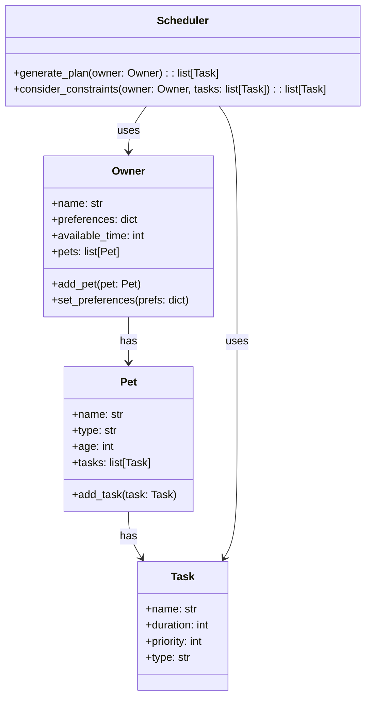

```mermaid
classDiagram
    class Owner {
        +name: str
        +preferences: dict
        +available_time: int
        +pets: list[Pet]
        +add_pet(pet: Pet)
        +set_preferences(prefs: dict)
    }
    class Pet {
        +name: str
        +type: str
        +age: int
        +tasks: list[Task]
        +add_task(task: Task)
    }
    class Task {
        +name: str
        +duration: int
        +priority: int
        +type: str
    }
    class Scheduler {
        +generate_plan(owner: Owner): list[Task]
        +consider_constraints(owner: Owner, tasks: list[Task]): list[Task]
    }
    Owner --> Pet : has
    Pet --> Task : has
    Scheduler --> Owner : uses
    Scheduler --> Task : uses
```